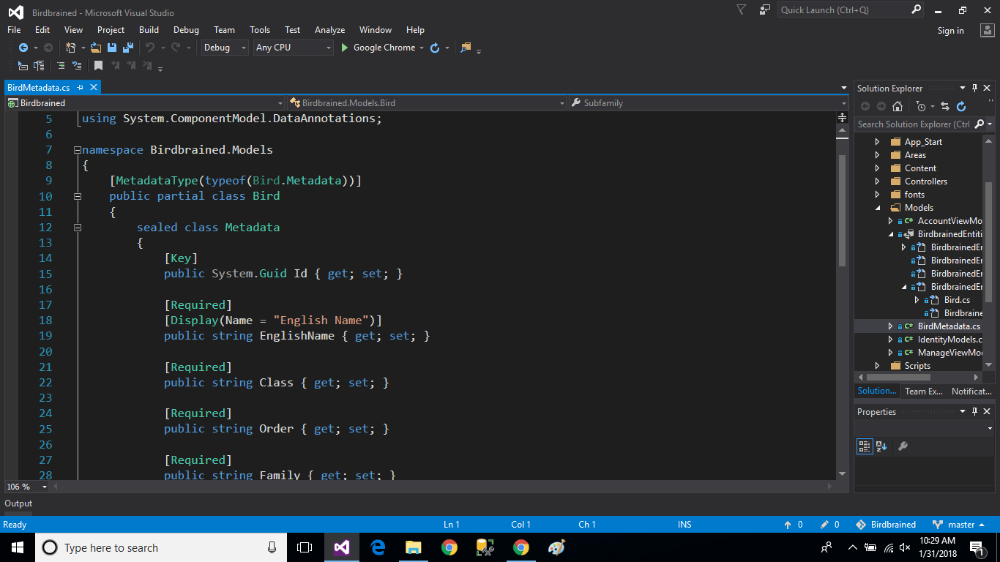

# Birdbrained
Birdbrained, an ASP.NET MVC project made in Visual Studio, is a taxonomic key to the birds of Tompkins County, NY. 

***THE DATA SOURCE***

An Excel spreadsheet from a field bio course I took in college serves as the data source for a SQL Server database: 

***THE CODE***

I imported the spreadsheet data into a new SSMS database.
In SSMS I reformatted the data types and added a Guid primary key.
I then detached the database from SSMS and attached it to my MVC solution in Visual Studio:

To my Models folder, I added an ADO.NET Entity Data Model, which generated a Bird partial class:

I then added another Bird partial class for metadata:

From the Bird Model, I scaffolded an Admin Controller in my Admin Area, authorized with total CRUD functionality:

I also scaffolded a User Controller to my User Area, with Details and Index Views only:

Here's the AdminArea/AdminBirds/Index View (left) opposite the UserArea/UserBirds/Index View (right):

Here's the AdminArea/AdminBirds/Details View (left) opposite the UserArea/UserBirds/Details View (right):

***RUNNING THE APPLICATION***

The Home Page:

The Index page for guests and guest users:

The Details page for guests and guest users:

The Index page for admins:

The Details page for admins:

